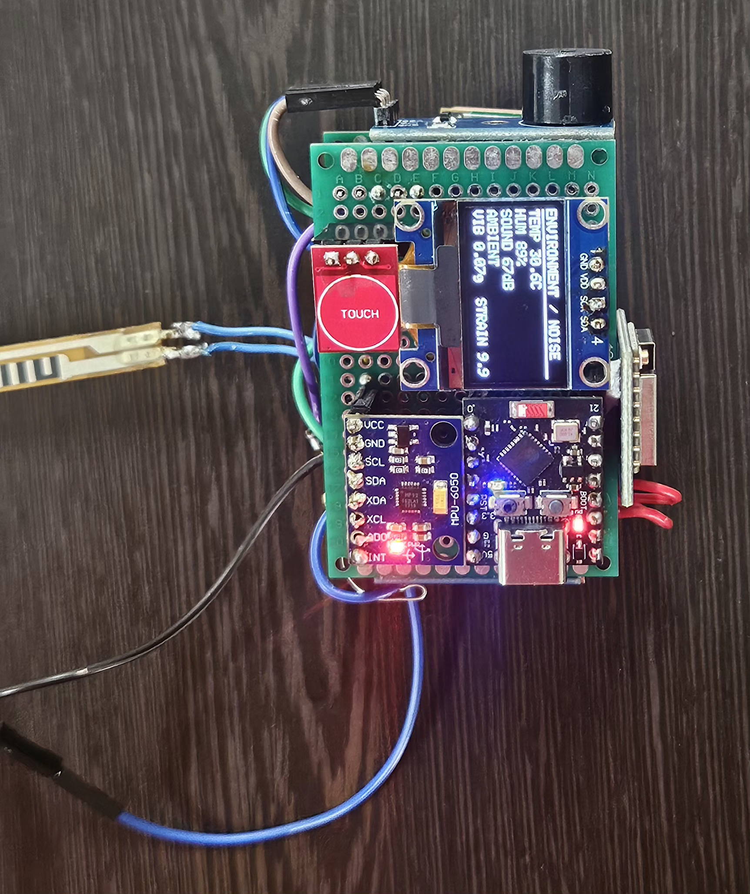

# SAMADHAAN

**Mine Subsidence Monitoring & Early Warning System**

**Smart India Hackathon 2026 · Problem Statement SIH26025**

SAMADHAAN is a hardware + software prototype for monitoring mine-related ground movement and sensor conditions. The project combines an ESP32 node with a local backend and web dashboard for monitoring, testing and demonstration.


## Prototype

### Hardware Node



The physical node is built around an ESP32 with an OLED display, MPU6050 and connected sensing hardware. The firmware reads the sensors available on the node and sends the readings to the software side.

### Monitoring Dashboard


The dashboard shows node status, sensor values, mine locations, incidents and the current risk state. Some screens use test or simulated data for demonstration.

### Scenario Lab / Digital Twin


The Scenario Lab is used to test different sensor conditions without waiting for a real mine event. The Digital Twin view is a visual representation for testing and demonstration; the displayed mine geometry is not surveyed mine data.

## Main Parts

- ESP32-based sensing node
- OLED display for local status
- MPU6050 and deformation/interaction sensing
- FastAPI backend for telemetry and WebSocket updates
- React dashboard for monitoring
- Serial bridge for connecting the physical node to the backend
- Scenario Lab for controlled test cases
- Risk calculation using sensor readings and data confidence

## How it works

```text
ESP32
  │
  └── USB Serial
        │
        ▼
  serial_bridge.py
        │
        ▼
     FastAPI
        │
        ├── Telemetry / Risk processing
        │
        └── WebSocket
                │
                ▼
          React Dashboard

Scenario Lab ───────────────► FastAPI
```

USB is the default hardware connection in the current repository. The firmware also contains an optional Wi-Fi path.

## Run Locally

Requirements: Python 3, Node.js and npm.

### Backend

```bash
cd backend
python3 -m venv .venv
source .venv/bin/activate
pip install -r requirements.txt
uvicorn main:app --host 127.0.0.1 --port 8000 --reload
```

### Frontend

Open another terminal:

```bash
cd frontend
npm install
npm run dev
```

Open the URL shown by Vite. When the backend is running, its API documentation is available at `http://127.0.0.1:8000/docs`.

## Connecting the ESP32

Flash [`firmware_samadhaan_node.ino`](firmware_samadhaan_node.ino) to the ESP32 and connect the board over USB.

From the repository root:

```bash
pip install pyserial requests
python3 serial_bridge.py
```

The bridge detects available serial devices and reconnects if the connection is interrupted. Sensor connection flags in the firmware should match the hardware that is actually connected.

## Project Files

- [`firmware_samadhaan_node.ino`](firmware_samadhaan_node.ino) — ESP32 firmware
- [`serial_bridge.py`](serial_bridge.py) — USB serial bridge
- [`backend/`](backend/) — API, telemetry and processing
- [`frontend/`](frontend/) — React dashboard
- [`DEMO_GUIDE.md`](DEMO_GUIDE.md) — demonstration steps and test cases
- [`API.md`](API.md) — API and WebSocket details

## Notes

The project contains both physical-node data and controlled test/simulation data. These are kept separate in the application where applicable. Risk values, forecasts and digital-twin views are intended for prototype evaluation and should not be treated as engineering or operational safety decisions.
